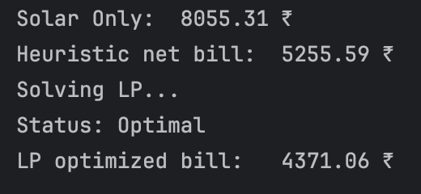
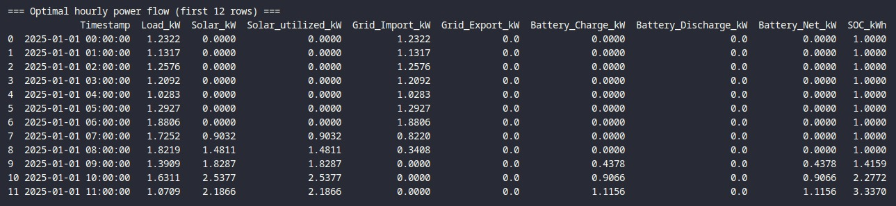
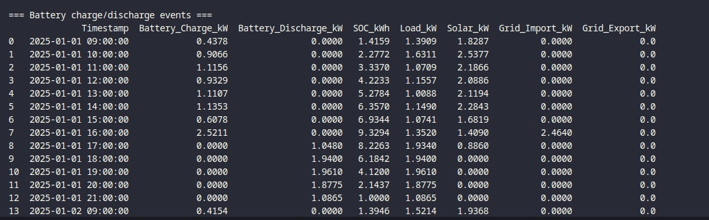

# Project Title : Solar_Energy_Dispatch 
### Team Name : Solar Sparks
### Member names : Tejas Kollipara BT2024147, Varun E BT2024220, K.Sai Tushar BT2024022

## Battery Energy Management Optimization 

This project simulates and optimizes battery energy storage behavior for a residential or commercial setting using solar generation and time-of-use pricing. It includes data preprocessing, heuristic simulation, linear programming-based optimization, and reporting/visualization.

---

## Project Structure

```
.
├── hourly_data.csv                  # Cleaned hourly input dataset
├── main.py                          # Main simulation and optimization script
├── make_reports.py                  # Generates post-optimization reports
├── comparison_schedule.csv          # Output comparison of Heuristic vs LP
├── optimal_hourly_flow.csv          # Detailed power flow results
├── battery_profile.csv              # Battery-specific activity report
└── plots/                           # Directory containing generated plots
```

---

## 1. Data Cleaning ,Preparation & EDA

**Purpose:**

* Convert 15-minute resolution data to hourly resolution.
* Strip unnecessary columns.
* Ensure consistent formatting and handle missing values.

**Exploratory Data Analysis Performed:**

- **Hourly Demand Over Time** – Visualizes fluctuations in consumption.
- **Distribution of Demand & Solar Generation** – Highlights peak values and frequency of different load/generation levels.
- **Correlation Heatmap** – Reveals relationships between key features.
- **Solar vs Load Comparison** – Provides insight into solar sufficiency.
- **One-day Solar Trend** – Demonstrates daily solar generation pattern.

These plots validate the data quality and guide the modeling strategy.


**Files:**

* `hourly_data.csv` (cleaned dataset)

**Main Columns Expected:**

* `Timestamp`: Date and hour
* `Demand`: Load demand in kW
* `Solar_Gen`: Solar generation in kW
* `Grid_Buy_Price`: Price to buy from grid
* `Grid_Sell_Price`: Price to sell to grid

---

## 2. Simulation and Optimization (`main.py`)

### Key Features:

* **Heuristic Simulation:**

  * Simple rule-based energy flow control.
  * Prioritizes PV → Load → Charge → Export logic.

* **LP Optimization (Using PuLP):**

  * Minimizes net electricity cost.
  * Constraints include:

    * Power balance
    * Battery capacity
    * SOC limits
    * Cyclic SOC for 24-hour loop

### Outputs:

* **comparison_schedule.csv:**
  Contains Heuristic vs LP import/export/charge/discharge schedules.
* Printed net bills and grid usage comparisons.

---

## 3. Report Generation (`make_reports.py`)

### Generates:

* **optimal_hourly_flow.csv**

  * Hourly power breakdown (load, solar, battery, grid).
* **battery_profile.csv**

  * Timestamped battery charge/discharge cycles with SOC.
* **Console Summary:**

  * Aggregated stats for import/export, throughput, etc.

---

## 4. Plots and Visualizations

### Key Graphs:

* Hourly Demand Over Time
* Distribution of Demand and Solar Generation
* Daily Trends (e.g., battery activity, SOC)
* Heuristic vs LP comparisons:

  * Grid Import
  * Battery Charge/Discharge
* Optimal Power Flow Trends

>  Tip: Most graphs also include both daily and full-period views for clarity.

---

## 5. How to Run

```bash
# Step 1: Prepare hourly_data.csv (cleaned)

# Step 2: Run the main optimization script
python main.py

# Step 3: Generate reports
python make_reports.py

# Step 4: Visualize using provided plotting scripts or notebooks
```

---

## 6. Libraries

* Python 3.7+
* pandas
* numpy
* PuLP
* matplotlib (for plotting)
* seaborn (optional, for styled histograms)

Install with:

```bash
pip install pandas numpy pulp matplotlib seaborn
```

---

## 7. Notes

* SOC stands for **State of Charge** (how full the battery is).
* PV refers to **Photovoltaic solar generation**.
* Assumes hourly time steps and fixed battery parameters.
* Pricing can be customized for real-world use cases.

---

## 8. Results

###  Cost Comparison

This project evaluates three scenarios:  
- **Solar Only (No Battery):** Basic setup without any battery storage.  
- **Heuristic Strategy:** A rule-based approach to charge/discharge the battery.  
- **LP Optimization:** A linear programming-based optimization of battery usage.  

**Cost Summary:**



---

### Optimal Hourly Power Flow Table

The following output snippet shows the optimal scheduling of power usage for each hour. It includes values for:
This helps visualize how the optimization algorithm balances solar generation, grid usage, and battery behavior.



---

### Battery Charge/Discharge Events Table

The following output snippet highlights specific hours where the battery actively charged or discharged. It includes the following details for each relevant time interval:
This table helps understand how the battery operates throughout the day to minimize grid costs and efficiently utilize solar energy.



---
